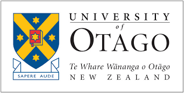

Welcome to my website. I am currently in the final year of a Ph.D. program in Finance, focusing on climate finance at the [Climate and Energy Finance Group (CEFGroup)](https://blogs.otago.ac.nz/cefg/), **University of Otago, New Zealand**. I am working with [Ivan Diaz-Rainey](https://www.otago.ac.nz/accountancyfinance/staff/otago032953.html) and [Helen Roberts](https://www.otago.ac.nz/accountancyfinance/staff/helenroberts.html) on analyzing the **Climate Risks in Microfinance Institutions** and developing a novel index to identify so-called **too-big-to-fail** -systemically important microfinance institutions (SIMFIs) as well as climate risks adjusted SIMFI index (CRSIMFIs).

I have assisted teaching undergraduate courses in finance including **Financial Markets and Institutions**, **Corporate Finance**, **Business Mathematics**, and have held guest lecture on **Climate Risks and Opportunities in Microfinance** at the University of Otago and **Climate Risks in Financial Institutions** at the **University of Manchester**. I also helped organize several events, such as CEFGroup Reading Sessions, [CEFGroup Seminars and Webinars](https://blogs.otago.ac.nz/cefg/cefgroup-webinar-do-firms-experiencing-more-wildfires-disclose-more-wildfire-information-in-their-10-ks/), [1st and 2nd CEFGroup Climate Finance Symposium](https://blogs.otago.ac.nz/cefg/cefgroup-past-events/call-for-papers-1st-cefgroup-climate-finance-symposium/), and [3rd GRASFI](https://www.susfinalliance2020.org/) side event on [Climate Finance in Asia and Australasia](https://blogs.otago.ac.nz/cefg/online-workshop-on-climate-finance-in-asia-and-australasia/).

Prior to joining the University of Otago, I gained research experience at the [Asian Research Institute of Banking and Finance](http://sefb.uum.edu.my/aribf/) and **Northern University of Malaysia** on several funded research projects. For example, I worked on a **Ministry of Higher Education (Malaysia)** funded project on MFI’s mission drifts in the ASEAN region. I did a research visit at the [Accounting Research Institute](https://ari.uitm.edu.my/) at the **MARA University of Technology** during my M.Sc. Recently, I provide assistance and analytics to a joint research project by the Northern University of Malaysia and the **Prince of Songkla University** on savings mobilization and **Inclusive Finance** in the ASEAN economies.

My research interests lie in Financial Economics of Climate Change, Climate and Development Finance. I am interested in how **climate change** poses financial risk and distress on **Firms, Financial Markets and Institutions** as well as the role of **Public Policy**, and **Climate-aligned Finance and Investment** for the **Net-Zero Transition**. My intellectual curiosity drives my passion for innovative and interdisciplinary research to support high-quality, evidence-based policy advice.


<button onclick="window.open('/files/IFTEKHAR_CV.pdf')">Download CV</button>

