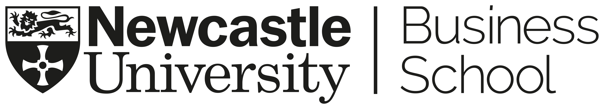

Welcome to my website. I am an Assistant Professor in Sustainable Finance and the module leader for a brand-new postgraduate module in “Green Finance and Sustainability” at Newcastle University Business School (NUBS). I am also the Lead Author for the IPBES nexus assessment, focusing on finance for biodiversity-related elements of the nexus.

My research interests lie in sustainable finance and environmental risk analytics, with applications in corporate finance, financial markets and institutions. Current projects try to inform and influence how the work of corporates and financial sectors can achieve an equitable, net-zero and nature-positive future (for people, planet and prosperity), with a particular interest in emerging markets and developing economies.

Before joining Newcastle, I held an academic-related position at the University of Cambridge, where he led a research project on "systemic resilience in investments" and supervised master’s dissertation on nature finance. In this capacity, I led collaborations on systemic resilience topics with a global network of pension funds, insurers and asset managers, with over $9 trillion under management and advice. I also held academic and research positions at the University of Otago, Universiti Utara Malaysia, Universiti Teknologi MARA, and has held guest lectures on climate-related financial risks at the Global Development Institute at the University of Manchester. I hold a PhD in Finance, specialising in climate finance and risks analytics from the University of Otago.


<button onclick="window.open('/files/IFTEKHAR_CV.pdf')">Download CV</button>


*Disclaimer: All views expressed on this site are mine. They do not reflect the views of my employers.*
